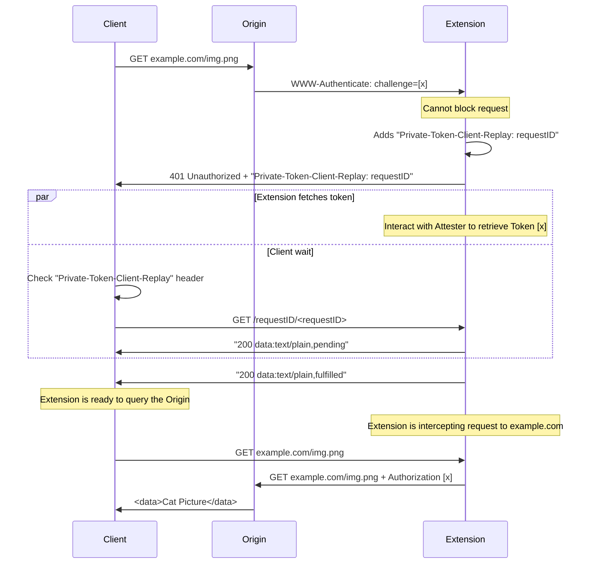

[](https://github.com/privacypass/challenge-bypass-extension/releases/)
[](https://github.com/privacypass/challenge-bypass-extension/actions)
[](https://opensource.org/licenses/BSD-3-Clause)

# Silk - Privacy Pass Client for the browser


This browser extension implements the client-side of the Privacy Pass protocol providing unlinkable cryptographic tokens.

**Specification:* Compliant with IETF [draft-ietf-privacypass-protocol v11](https://datatracker.ietf.org/doc/draft-ietf-privacypass-protocol/).

**Support:**

* ✅ Public-Verifiable tokens (Blind-RSA)
* 🚧 Private-Verifiable tokens (VOPRF)
* 🚧 Batched tokens
* 🚧 Rate limited tokens


Home page: **[https://privacypass.github.io][pp-home]**

## Installation

| **[Chrome][chrome-store]** | **[Firefox][firefox-store]** |
| -- | -- |
| [][chrome-store] | [][firefox-store] |

## How it works?

**Privacy Pass Attesters:**  🟩 [Cloudflare Research with Turnstile][cf-url]

[pp-home]: https://privacypass.github.io/
[cf-url]: https://pp-attester-turnstile.research.cloudflare.com/
[chrome-store]: https://chrome.google.com/webstore/detail/privacy-pass/ajhmfdgkijocedmfjonnpjfojldioehi/
[firefox-store]: https://addons.mozilla.org/firefox/addon/privacy-pass/

**Get tokens**
 - If a website requests a Privacy Pass token, the extension is automatically going to request you to perform the associated challenge.
 - One page will open with a challenge to be solved.
 - Solve successfully the challenge and the extension will get **one** token.


See [FAQs](#faqs) and [Known Issues](#known-issues) section: if something is not working as expected.

---

## Installing from Sources

We recommend to install the extension using the official browser stores listed in [Installation](#Installation) section above. If you want to compile the sources or your browser is not supported, you can install the extension as follows.

### Building

```sh
git clone https://github.com/privacypass/challenge-bypass-extension
nvm use 16
npm ci
npm run build
```

Once these steps complete, the `dist` folder will contain all files required to load the extension.

### Running Tests

```sh
nvm use 16
npm ci
npm test
```

### Manually Loading Extension

#### Firefox

1. Open Firefox and navigate to [about:debugging#/runtime/this-firefox/](about:debugging#/runtime/this-firefox/)
1. Click on 'Load Temporary Add-on' button.
1. Select `manifest.json` from the `dist` folder.
1. Check extension logo appears in the top-right corner of the browser.

#### Chrome

1. Open Chrome and navigate to [chrome://extensions/](chrome://extensions/)
1. Turn on the 'Developer mode' on the top-right corner.
1. Click on 'Load unpacked' button.
1. Select the `dist` folder.
1. Check extension logo appears in the top-right corner of the browser.
1. If you cannot see the extension logo, it's likely not pinned to the toolbar.

#### Edge

-   Open Edge and navigate to [edge://extensions/](edge://extensions/)
-   Turn on the 'Developer mode' on the left bar.
-   Click on 'Load unpacked' button in the main panel.
-   Select the `dist` folder.
-   The extension will appear listed in the main panel.
-   To see the extension in the bar, click in the puzzle icon and enable it, so it gets pinned to the toolbar.
---

### Highlights

**2018** -- The Privacy Pass protocol is based on a _Verifiable, Oblivious Pseudorandom Function_ (VOPRF) first established by [Jarecki et al. 2014](https://eprint.iacr.org/2014/650.pdf). The details of the protocol were published at [PoPETS 2018](https://doi.org/10.1515/popets-2018-0026) paper authored by Alex Davidson, Ian Goldberg, Nick Sullivan, George Tankersley, and Filippo Valsorda.

**2019** -- The captcha provider [hCaptcha](https://www.hcaptcha.com/privacy-pass) announced support for Privacy Pass, and the [v2](https://github.com/privacypass/challenge-bypass-extension/tree/2.0.0) version was released.

**2020** -- The CFRG (part of IRTF/IETF) started a [working group](https://datatracker.ietf.org/wg/privacypass/about/) seeking for the standardization of the Privacy Pass protocol.

**2021** -- In this [blog post](https://blog.cloudflare.com/privacy-pass-v3), we announced the [v3](https://github.com/privacypass/challenge-bypass-extension/tree/v3.0.0) version of this extension, which makes the code base more resilient, extensible, and maintainable.

**2022** -- The Privacy Pass protocol can also use RSA blind signatures.

**2023** -- The extension updates to Privacy Pass Protocol draft 16, with the cryptographic part in a dedicated library [cloudflare/privacypass-ts](https://github.com/cloudflare/privacypass-ts). Introducing the notion of Attesters and Issuers.

#### Acknowledgements

The creation of the Privacy Pass protocol was a joint effort by the team made up of George Tankersley, Ian Goldberg, Nick Sullivan, Filippo Valsorda, and Alex Davidson.

The Privacy Pass team would like to thank Eric Tsai for creating the logo and extension design, Dan Boneh for helping us develop key parts of the protocol, as well as Peter Wu and Blake Loring for their helpful code reviews. We would also like to acknowledge Sharon Goldberg, Christopher Wood, Peter Eckersley, Brian Warner, Zaki Manian, Tony Arcieri, Prateek Mittal, Zhuotao Liu, Isis Lovecruft, Henry de Valence, Mike Perry, Trevor Perrin, Zi Lin, Justin Paine, Marek Majkowski, Eoin Brady, Aaran McGuire, Suphanat Chunhapanya, Armando Faz Hernández, Benedikt Wolters, Maxime Guerreiro, Cefan Rubin, Thibault Meunier and many others who were involved in one way or another and whose efforts are appreciated.

---

## FAQs

#### As a user, how can I add new attestation methods

Depending on your browser settings, the local storage of your browser may be cleared when it is restarted. Privacy Pass stores passes in local storage and so these will also be cleared. This behavior may also be observed if you clear out the cache of your browser.

#### My website support Privacy Pass authentication scheme, but the extension does nothing

This can be an issuer issue, or a Chrome issue. In the later case, make sure you implement a [client replay on your website](#chrome-support-via-client-replay-api).

#### As a service operator, how to roll out out my own attestation method

Privacy Pass does not propose a standard attester API. This extension relies on attester to implement the [cloudflare/pp-attester](https://github.com/cloudflare/pp-attester) API.

If you have such an attester, you should ask your user to update their attesters in the extension options. The attester order matters, first one has a higher priority than the second.

---

## Known Issues

#### Extensions that modify user-agent or headers

There is a [conflict resolution](https://developer.chrome.com/docs/extensions/reference/webRequest/#conflict-resolution) happening when more than one extension tries to modify the headers of a request. According to documentation, the more recent installed extension is the one that can update headers, while others will fail.

Compounded to that, Cloudflare will ignore clearance cookies when the user-agent request does not match the one used when obtaining the cookie.

## Chrome support via Client replay API

### Overview

Chrome does not allow extensions to block a request and perform another action, such as completing an attestation flow. To this extent, the extension enables websites to orchestrate a client side replay as defined below.

### Requirements

Your website fetches subressources with JavaScript. If your server returns a challenge on the main frame, the extension automatically refreshes the page without any action needed from your side.

### System definition

On every request, the extension adds header `Private-Token-Client-Replay: <requestID>`. `requestID` is a UUID identifying your next replay attempt.
For resources you know need to be replayed because they contain a `WWW-Authenticate: PrivateToken ...` header, you are going to use this `requestID` to query the extension on the state of the associated token retrieval. Once the extension has retrieved the token, you can replay the request.

Given a `requestID`, you can query `https://no-reply.private-token.research.cloudflare.com/requestID/<requestID>`. The domain `no-reply.private-token.research.cloudflare.com` [does not resolve](https://dnsviz.net/d/no-reply.private-token.research.cloudflare.com/dnssec/) to an IP address, and is captured by the browser extension for replay purposes. Its reply is always going to be a redirect to a ["data" URL](https://www.rfc-editor.org/rfc/rfc2397#section-2) of the form `data:text/plain,<status>`.

**`GET /requestID/<requestID>`**
* Response URL: `data:text/plain,<status>`
* `status` is `pending`, `fulfilled`, `not-found`

Your website should do the following depending on the returned `status`:
* if `pending`, wait and query `/requestID/<requestID>` again in the future
* if `fulfilled`, replay the initial request
* if `not-found`, cancel the initial request

A sequence diagram illustrate the flow below



### Design considerations

The proposed replay mechanism has been contrained by [Chrome API reference](https://developer.chrome.com/docs/extensions/reference/), specifically the [declarativeNetRequest API](https://developer.chrome.com/docs/extensions/reference/declarativeNetRequest/).

Specifically, the following choices have been engineered as follow
* Use a dedicated replay domain to allow any website to query the extension without hardcoding its ID
* Use a dedicated replay domain that does not resolve to prevent DoS risks, and ensure there are no traffic interception with a faulty extension
* Have every parameter, namely `requestID` be part of the URL to allow for a synchronous response from the extension, headers not being available on every event
* Redirect to a ["data" URL](https://www.rfc-editor.org/rfc/rfc2397#section-2) to prevent DNS resolution and other extensions interference
* Return `Private-Token-Client-Replay: <requestID>` on every request due to the inability to dynamically append headers to responses in MV3
* Use a pull based method to ease implementation on the extension and origin side
